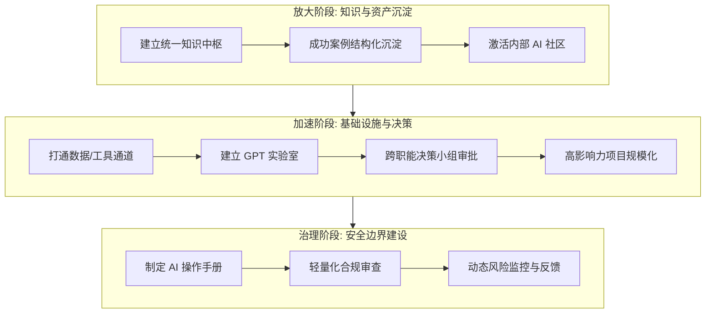

# 企业级 AI 规模化落地与治理架构深度分析报告

---

### 一、 综述与概念

**核心主题**：
本文档旨在探讨企业在完成 AI 初步对齐（Align）与激活（Activate）后，如何通过“放大（Amplify）”、“加速（Accelerate）”与“治理（Govern）”三大核心支柱，实现从“单点试点”向“全组织生产力引擎”的质变。报告强调，AI 领先地位的构建不在于工具的堆砌，而在于组织环境对技术变化的自适应能力。

**核心技术与管理概念定义**：
1.  **定制化 GPT (Custom GPTs)**：基于大语言模型（LLM），针对特定业务逻辑、私有知识库封装的微型 AI 应用。
2.  **AI 知识中枢 (AI Knowledge Hub)**：企业级 RAG（检索增强生成）的基础形态，用于沉淀提示词工程、成功案例与政策规范。
3.  **GPT 实验室 (GPT Lab)**：一种敏捷开发模式，通过跨职能小组快速验证 AI 用例的可行性与规模化潜力。
4.  **去中心化创新 (Decentralized Innovation)**：将 AI 开发能力下放至最接近业务痛点的员工，降低技术准入门槛。
5.  **负责任的 AI (Responsible AI)**：在加速创新的同时，嵌入安全、伦理及合规性的防御性边界。

---

### 二、 细节深度解析

#### 1. 技术落地逻辑拆解
企业 AI 规模化落地遵循从“知识沉淀”到“基础设施赋能”再到“安全闭环”的逻辑演进。以下是核心执行路径的 Mermaid 流程图：

#### 2. 关键信息矩阵
基于文中提供的案例（雅诗兰黛、BBVA、Promega），提炼出的关键执行点与工具链如下：

| 维度 | 关键动作 | 核心工具/载体 | 核心指标 (KPI/Metrics) |
| :--- | :--- | :--- | :--- |
| **放大 (Amplify)** | 知识共享与社区运营 | Confluence, SharePoint, 飞书/钉钉, AI Newsletter | 知识库访问量、社区活跃度、案例复用率 |
| **加速 (Accelerate)** | 去中心化构建与快速审批 | ChatGPT Enterprise, GPT Store, 跨职能 AI 决策小组 | 项目从试点到落地的周期、GPT 创建数量、每周活跃用户数 |
| **治理 (Govern)** | 建立安全边界与动态审查 | 负责任 AI 操作手册, 定制合规查询 GPT | 合规响应速度、风险事件拦截率、治理流程延误率 |

#### 3. 细节技术亮点分析
*   **雅诗兰黛的“两页纸”产品冲刺**：通过极简化的文档（目标、场景、价值）降低了 AI 项目申报的摩擦力，解决了大企业病带来的“过度评估”问题。
*   **BBVA 的去中心化实践**：分发 3000 个账号，让“最接近问题的人”构建了 2900 多个 GPT。这体现了 AI 开发从 **Shadow IT** 向 **Citizen Development（全民开发）** 的转变。
*   **Promega 的奖励机制**：将 AI 节约的时间和资源回馈给创新团队，形成了正向的“创新红利循环”。

#### 4. 跨领域关联：安全与 AI 的博弈
在“治理”维度，文中所述体现了 **安全前置 (Shift-Left Security)** 的思想：
*   **AI 赋能合规**：利用定制 GPT 解读复杂的合规手册，将静态的政策条文转化为动态的自然语言查询，降低了员工误操作导致的合规风险。
*   **边界设定**：通过区分“安全尝试”与“需升级处理”的场景，在确保数据安全（尤其是企业核心资产）的前提下，最大化创新的自由度。

---

### 三、 结论与启示

#### 1. 总结性见解
企业 AI 的竞争已经进入“组织效能”阶段。早期的 AI 应用是个别极客的“单兵作战”，而现在的趋势是**“基础设施化”**与**“平民化”**。成功的企业不仅是在买模型，而是在重构一套能够支撑 AI 快速迭代的“操作系统”。

#### 2. 落地/防御建议
*   **构建“AI 导航员”体系**：不要仅依赖 IT 部门，应在各业务线培养“AI Champions”，他们负责识别高价值场景并反馈给技术侧。
*   **实施“轻量化治理”**：建议建立自动化安全审计工具（如针对 Prompt 注入的过滤、敏感数据脱敏检测），替代繁重的纯人工审批。
*   **数据资产价值化**：如雅诗兰黛案例所示，将 75 年以上的历史数据作为 RAG 的底层支持，是建立企业 AI 护城河的关键。

#### 3. 未来演进预测
*   **Agentic Workflow（智能体工作流）**：未来的 GPT 将不再是孤岛，而是能够跨部门协作的智能体。例如，信贷分析 GPT 自动对接法务 GPT 进行合规性校验。
*   **自主化治理**：AI 治理将从“人工手册”演变为“AI 监管 AI”，即由专门的监管模型对业务模型进行实时审计。
*   **组织形态扁平化**：随着 AI 承担了大量的协调、整理和初步分析工作，中间管理层的职能将向“AI 教练”和“战略决策者”快速转型。

---
**分析师点评**：该指南不仅是一份管理手册，更是一份关于“企业智能化转型”的底层逻辑白皮书。其核心价值在于将 AI 视为一种**“新的工作方式”**而非**“工具增量”**。