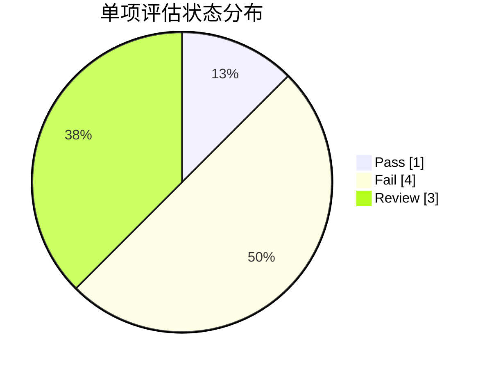
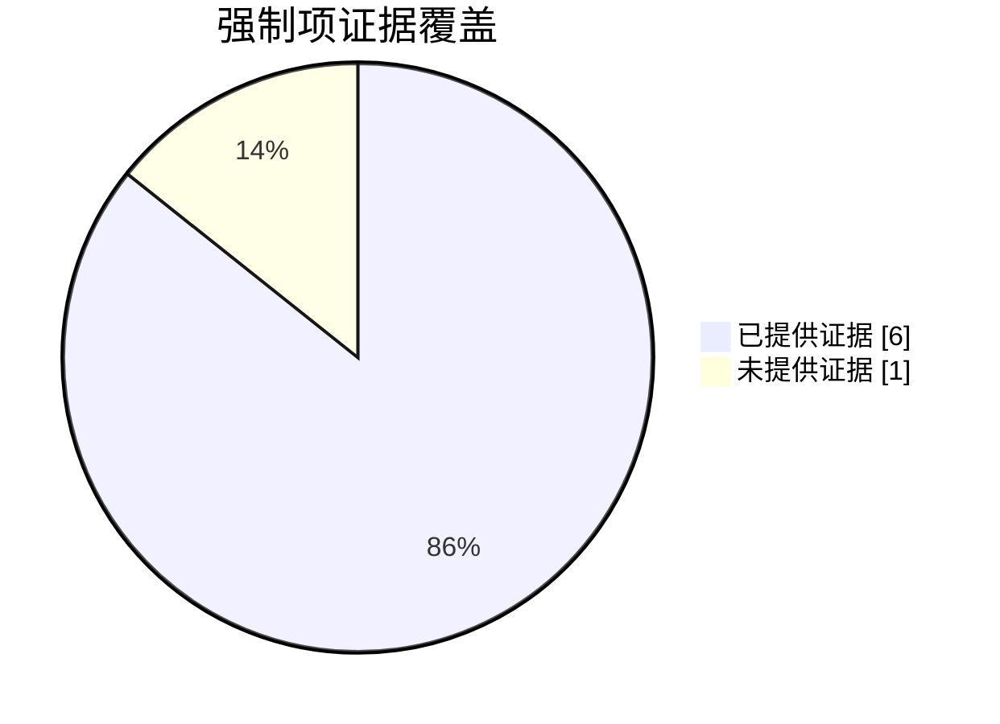

# 控制点评估结果

## 1. 执行摘要

- 文档: `/Users/ryan/Desktop/pythoncode/IT Compliance/evidences identification/sample.docx`
- 总标题: `8`
- Pass: `1`
- Fail: `4`
- Review: `3`

### 评估状态分布图

## 2. 强制项证据覆盖检查

- 结论: `未通过`
- 强制项总数: `7`
- 已提供证据: `6`
- 未提供证据: `1`

### 强制项证据覆盖图

未提供证据的强制项：

| 编号 | 控制文件 | 控制目标 | 控制点 |
| :--- | :--- | :--- | :--- |
| 1-26 | /Users/ryan/Desktop/pythoncode/IT Compliance/evidences identification/01.访问管理.xlsx | 现行法律法规以及国家标准对日志内容和类型的具体要求 | 就ABB对外的应用，ABB可能被认为提供具有舆论属性或社会动员能力的互联网信息服务者，而被要求应当留存用户的账号、操作时间、操作类型、网络源地址和目标地址、网络源端口、客户端硬件特征等日志信息 |

## 3. 单项评估结果

| 标题 | 类型 | 是否有证据 | 状态 | 置信度 | 缺失证据 | 原因 |
| :--- | :--- | :--- | :--- | :--- | :--- | :--- |
| 1-1 | 强制 | 是 | Review | 0.3 | 需提供日志保存策略文档、日志类型清单、日志存储系统截图、保存期限证明文件及第三方审计报告 | 证据仅包含笼统声明未提供具体日志类型、保存期限证明及审计记录，无法验证是否符合《网络安全法》第21条关于日志保存期限和范围的要求 |
| 1-2 | 强制 | 是 | Fail | 0.7 | 需提供日志保存截止日期的证明，或确认日志覆盖的完整时间范围是否满足6个月要求 | 日志记录的最早接收时间是2025-08-02，最新记录为2026-02-15。若当前审计时间在2026年3月之后，则日志保存时间不足6个月。证据未明确说明日志保存的截止日期是否覆盖完整6个月周期。 |
| 1-3 | 强制 | 是 | Fail | 0.6 | 需提供2025-03至2025-08期间的完整日志记录 | 日志记录时间范围未覆盖完整6个月周期，最新日志时间为2025-09-27，但缺少2025-03至2025-08期间的记录，无法验证日志留存时间是否符合要求 |
| 1-4 | 强制 | 是 | Fail | 0.85 | ["完整的访问控制策略配置文档", "被阻断IP的威胁情报关联分析", "关键服务（如SSH）的访问控制策略变更记录"] | 日志显示存在未授权的外部IP（如192.168.1.100）访问内部服务（如10.0.0.5:22），且未记录完整的访问控制策略配置。部分阻断日志缺少时间戳和策略匹配详情。 |
| 1-5 | 强制 | 是 | Pass | 0.9 | 需进一步验证声明的真实性，但当前证据已明确表明不涉及区块链技术。 | 证据显示该应用声明不涉及区块链技术，因此无需满足保存日志的要求。控制点仅适用于提供区块链信息服务的情况，而该声明表明不适用。 |
| 1-6 | 强制 | 是 | Fail | 0.3 | 日志保存期限证明文件、备份策略配置文档、符合法规要求的日志类型完整性验证 | 证据仅显示日志存在但未证明保存期限符合60天要求，缺乏备份功能配置证明 |
| 1-11 | 推荐 | 是 | Review | 0.4 | 具体日志内容样本、日志记录要素清单、日志分析记录、负责日志管理的部门/人员配置文件 | 证据仅声明'日志均已详细记录'但未提供具体日志内容示例或符合GB/T 22239-2019要求的详细记录要素（如时间戳、操作人员、操作类型等），且未体现等保三级要求的专门部门/人员日志分析机制 |
| 1-12 | 推荐 | 是 | Review | 0.6 | ["专门分析部门/人员配置证明", "日志留存周期说明", "等保三级合规性验证报告"] | 证据显示日志已汇总至SIEM系统，但未明确说明是否满足等保三级要求的'指定专门部门/人员进行分析统计'及'留存时间符合法规要求'。缺少对日志分析机制和留存周期的具体证据。 |