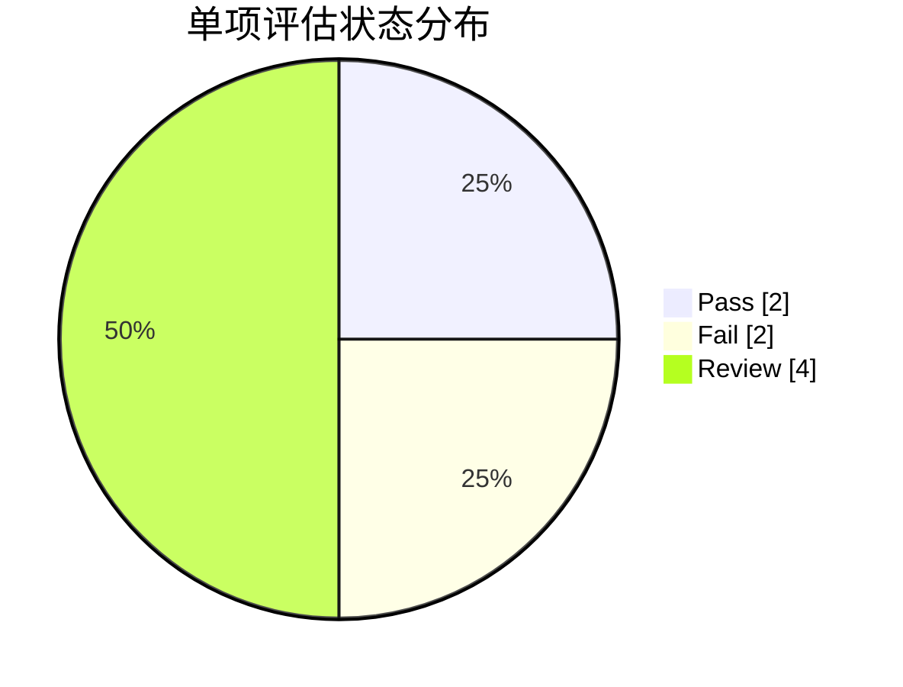
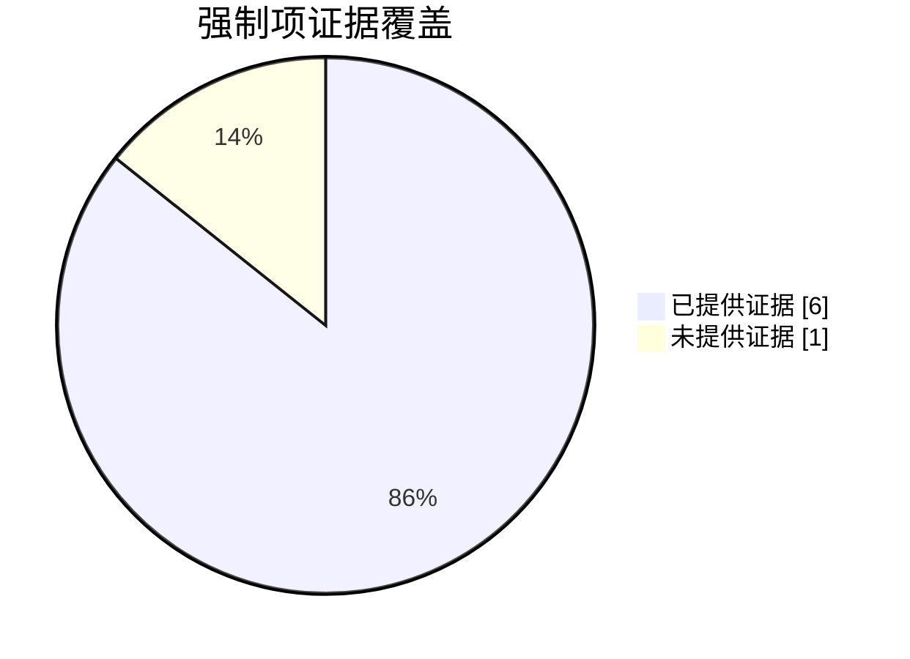

# 控制点评估结果

## 1. 执行摘要

- 文档: `C:\Users\CNRYFU2\Desktop\AI-tools\IT Compliance\evidences identification\sample.docx`
- 相关脚本: `ITCC/controls identification/generate_compliance_matrix_omlx.py`
- 总标题: `8`
- Pass: `2`
- Fail: `2`
- Review: `4`

### 评估状态分布图

## 2. 强制项证据覆盖检查

- 结论: `未通过`
- 强制项总数: `7`
- 已提供证据: `6`
- 未提供证据: `1`

### 强制项证据覆盖图

未提供证据的强制项：

| 编号 | 控制文件 | 控制目标 | 控制点 |
| :--- | :--- | :--- | :--- |
| 1-26 | C:\Users\CNRYFU2\Desktop\AI-tools\IT Compliance\evidences identification\01.访问管理.xlsx | 现行法律法规以及国家标准对日志内容和类型的具体要求 | 就ABB对外的应用，ABB可能被认为提供具有舆论属性或社会动员能力的互联网信息服务者，而被要求应当留存用户的账号、操作时间、操作类型、网络源地址和目标地址、网络源端口、客户端硬件特征等日志信息 |

## 3. 单项评估结果

| 标题 | 类型 | 是否有证据 | 状态 | 置信度 | 缺失证据 | 原因 |
| :--- | :--- | :--- | :--- | :--- | :--- | :--- |
| 1-1 | 强制 | 是 | Review | 0.5 | ["日志保存期限的具体起止日期记录", "日志类型和内容的详细清单", "日志存储介质的审计报告或技术验证记录"] | 证据仅包含声明性文本未提供具体日志保存期限证明文件（如日志存储起止日期记录）及日志类型清单，无法验证是否满足《网络安全法》第21条关于保存期限和日志范围的要求 |
| 1-2 | 强制 | 是 | Pass | 0.95 | [] | 日志记录覆盖了2025年8月至2026年2月的漏洞信息，时间跨度超过6个月要求。所有记录包含必要字段（接收时间、处理状态等），且保存完整。 |
| 1-3 | 强制 | 是 | Fail | 0.6 | 需提供至少覆盖前6个月完整时间范围的日志记录，例如2025-03-31至2025-09-30期间的操作日志 | 日志记录的时间范围不足六个月。证据中最新操作时间为2025-09-27，最早为2025-08-04，仅覆盖约2个月，无法证明留存时间符合不少于6个月的要求。 |
| 1-4 | 强制 | 是 | Fail | 0.85 | ["访问控制策略文档及审批记录", "高危端口访问的完整审计日志", "异常访问行为的实时告警日志"] | 日志显示存在大量被阻断的访问请求（如192.168.1.100→10.0.0.5:3389），但未提供完整的访问控制策略文档和审批记录。部分高危端口（如3389）的访问未记录完整审计轨迹，且缺少对异常访问行为的实时告警日志。 |
| 1-5 | 强制 | 是 | Pass | 0.9 | 需进一步验证声明的真实性，例如技术架构文档或第三方审计报告，以确认是否完全不涉及区块链服务。 | 证据显示该应用不涉及区块链技术，因此无需满足保存日志的控制点要求。法规仅适用于提供区块链信息服务的情况。 |
| 1-6 | 强制 | 是 | Review | 0.4 | 1. 日志保存期限证明文件 2. 用户注册信息日志记录 3. 内部/外部地址映射日志 4. 网络安全事件记录凭证 | 证据仅显示日志类型但未提供保存期限证明，缺少用户注册信息、网络地址映射关系等关键日志类型，无法确认是否满足60天保存要求 |
| 1-11 | 推荐 | 是 | Review | 0.5 | 需提供具体日志记录内容示例、日志记录范围说明及日志分析机制文档 | 证据仅笼统说明'日志均已详细记录'，但未明确具体记录了哪些运维操作日志内容（如日常巡检、参数修改等），且未体现三级要求的专门部门/人员分析日志的要求 |
| 1-12 | 推荐 | 是 | Review | 0.6 | 未提供日志留存期限证明、日志分析责任人信息、SIEM系统分析功能验证材料 | 证据显示日志已汇总至SIEM系统，但未明确说明是否满足等保三级要求的专门部门/人员分析、日志留存时间等关键要素 |