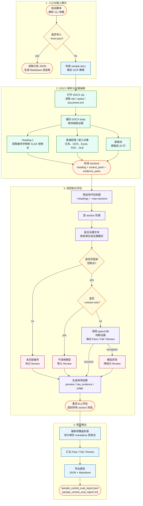

# sample_control_point_eval_demo.py Workflow

```mermaid
flowchart TD
    start([启动脚本<br/>解析 CLI 参数])
    fromJson{是否传入<br/>--from-json?}
    mdOnly([读取已有 JSON<br/>生成 Markdown 后结束])
    prepare[检查 sample.docx<br/>确定 OCR 策略]

    openDocx[打开 DOCX zip<br/>读取 rels / styles / document.xml]
    scanBody[遍历 DOCX body<br/>按块抽取证据]

    heading[Heading 1<br/>提取编号并映射 XLSX 控制点]
    paragraph[普通段落 / 嵌入对象<br/>文本、OCR、Excel、PDF、OLE]
    table[表格块<br/>提取前 20 行]
    sections([形成 sections<br/>heading + control_point + evidence_parts])

    select[筛选待评估标题<br/>--headings / --max-sections]
    perSection[逐 section 处理]
    combine[组合证据文本<br/>按来源生成证据概览]
    controlFound{是否匹配到<br/>控制点?}

    noControl[未匹配编号<br/>标记 Review]
    extractOnly{是否<br/>--extract-only?}
    skipJudge[不调用模型<br/>默认 Review]
    judge[调用 qwen3:8b<br/>判断证据<br/>输出 Pass / Fail / Review]
    judgeError[模型异常<br/>降级为 Review]
    result[生成单项结果<br/>preview / has_evidence / judge]

    loopDone([重复以上评估<br/>直到所有 section 完成])
    coverage[强制项覆盖检查<br/>统计缺失 mandatory 控制点]
    summary[汇总 Pass / Fail / Review]
    write[写出报告<br/>JSON + Markdown]
    outputs([sample_control_eval_report.json<br/>sample_control_eval_report.md])

    start --> fromJson
    fromJson -- yes --> mdOnly
    fromJson -- no --> prepare

    prepare --> openDocx --> scanBody
    scanBody --> heading
    scanBody --> paragraph
    scanBody --> table

    heading --> sections
    paragraph --> sections
    table --> sections

    sections --> select --> perSection --> combine --> controlFound
    controlFound -- no --> noControl --> result
    controlFound -- yes --> extractOnly
    extractOnly -- yes --> skipJudge --> result
    extractOnly -- no --> judge
    judge -- success --> result
    judge -- exception --> judgeError --> result

    result --> loopDone --> coverage --> summary --> write --> outputs

    subgraph S1["1. 入口与输入模式"]
        start
        fromJson
        mdOnly
        prepare
    end

    subgraph S2["2. DOCX 解析与证据抽取"]
        openDocx
        scanBody
        heading
        paragraph
        table
        sections
    end

    subgraph S3["3. 逐控制点评估"]
        select
        perSection
        combine
        controlFound
        noControl
        extractOnly
        skipJudge
        judge
        judgeError
        result
        loopDone
    end

    subgraph S4["4. 报告输出"]
        coverage
        summary
        write
        outputs
    end

    classDef startEnd fill:#fff4e6,stroke:#d9480f,stroke-width:1.5px,color:#212529;
    classDef process fill:#e7f5ff,stroke:#1971c2,stroke-width:1.5px,color:#212529;
    classDef extract fill:#e6fcf5,stroke:#2b8a3e,stroke-width:1.5px,color:#212529;
    classDef eval fill:#f3f0ff,stroke:#6741d9,stroke-width:1.5px,color:#212529;
    classDef decision fill:#fff9db,stroke:#e67700,stroke-width:1.5px,color:#212529;
    classDef review fill:#fff0f6,stroke:#c2255c,stroke-width:1.5px,color:#212529;

    class start,mdOnly,sections,loopDone,outputs startEnd;
    class prepare,coverage,summary,write process;
    class openDocx,scanBody,heading,paragraph,table extract;
    class select,perSection,combine,judge,result eval;
    class fromJson,controlFound,extractOnly decision;
    class noControl,skipJudge,judgeError review;
```

说明: `build_sections_and_evidence()` 内部会循环遍历 DOCX body，主流程中也会循环处理每个 section。图里用“重复以上评估直到所有 section 完成”表达循环，避免回流箭头影响阅读。
