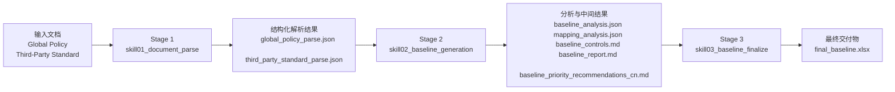

# Cloud Security Baseline Agent

## 项目背景

Cloud Security Baseline Agent 的目标，是把两类安全文档：

- Global Policy 文档
- Third-Party Standard 文档

转换成一套适用于阿里云场景的、格式固定、可交付、可审阅的安全基线结果。

在实际安全治理场景中，这两类文档通常存在几个问题：

- 原始格式通常是 PDF、Markdown 或文本，不适合直接做治理执行
- 组织标准偏治理语言，第三方标准偏控制项语言，难以直接一一对齐
- 人工做 requirement 提取和映射，成本高且不稳定
- 即使完成映射，也常缺少统一、可复核的最终交付格式

这个项目因此被设计成一条完整的 agent pipeline：先解析，再映射，再产出最终交付物。

## 项目目标

项目最终要完成的是：

1. 读取组织标准与第三方标准
2. 将原始文档解析为结构化 requirement 数据
3. 比较 Third-Party Standard 和 Global Policy 之间的覆盖关系
4. 识别哪些控制项：
   - 可以直接沿用
   - 需要做平台适配
   - 需要新增为基线控制
   - 只属于组织治理要求
5. 输出格式固定的最终交付物
6. 对所有关键产物执行本地 schema 校验，保证结果稳定

## 当前正式主流程

当前正式运行的主流程由三个 stage 构成：

1. `skill01_document_parse`
2. `skill02_baseline_generation`
3. `skill03_baseline_finalize`

另外，`skill02` 会内部调用一个辅助 skill：

- `baseline_writer`

当前正式运行中的 skills 为：

- [`skills/skill01_document_parse`](/Users/ryan/Desktop/pythoncode/cloud-security-baseline-agent/skills/skill01_document_parse)
- [`skills/skill02_baseline_generation`](/Users/ryan/Desktop/pythoncode/cloud-security-baseline-agent/skills/skill02_baseline_generation)
- [`skills/skill03_baseline_finalize`](/Users/ryan/Desktop/pythoncode/cloud-security-baseline-agent/skills/skill03_baseline_finalize)
- [`skills/baseline_writer`](/Users/ryan/Desktop/pythoncode/cloud-security-baseline-agent/skills/baseline_writer)

历史遗留 skill、旧模板、demo 样例和构建中间产物已统一归档到：

- [`archive/`](/Users/ryan/Desktop/pythoncode/cloud-security-baseline-agent/archive)

## 总体架构



## Stage 1: 文档解析

### 使用的 skill

- [`skills/skill01_document_parse`](/Users/ryan/Desktop/pythoncode/cloud-security-baseline-agent/skills/skill01_document_parse)

核心脚本：

- [`skills/skill01_document_parse/scripts/run_parse.py`](/Users/ryan/Desktop/pythoncode/cloud-security-baseline-agent/skills/skill01_document_parse/scripts/run_parse.py)

### 输入

- `cases/<case_name>/input/global_policy/*`
- `cases/<case_name>/input/third_party_standard/*`

### 主要做什么

Stage 1 是理解原始文件的阶段。

它分别处理 Global Policy 和 Third-Party Standard，主要做以下工作：

1. 读取 PDF / MD / TXT 文件
2. 提取文本内容
3. 清理页码、目录噪声、乱码与无效格式
4. 从文档中提取 requirement
5. 为 requirement 补充结构化字段：
   - `requirement_id`
   - `source_requirement_id`
   - `section`
   - `statement`
   - `category`
   - `priority`
   - `service`
   - `source_excerpt`
6. 必要时调用 LLM 进行文本增强解析
7. 当 PDF 质量不足时，必要时调用 vision 辅助识别
8. 在写盘前执行本地 schema 校验

### 使用到的运行时模块

- [`runtime/pdf_parser.py`](/Users/ryan/Desktop/pythoncode/cloud-security-baseline-agent/runtime/pdf_parser.py)
- [`runtime/text_utils.py`](/Users/ryan/Desktop/pythoncode/cloud-security-baseline-agent/runtime/text_utils.py)
- [`runtime/document_pipeline.py`](/Users/ryan/Desktop/pythoncode/cloud-security-baseline-agent/runtime/document_pipeline.py)
- [`runtime/ollama_runtime.py`](/Users/ryan/Desktop/pythoncode/cloud-security-baseline-agent/runtime/ollama_runtime.py)

### 输出

- `global_policy_parse.json`
- `third_party_standard_parse.json`

### 一句话理解

Stage 1 的作用是：

**把原始文档变成机器可处理的结构化 requirement 数据。**

## Stage 2: 映射分析与基线生成

### 使用的 skill

- [`skills/skill02_baseline_generation`](/Users/ryan/Desktop/pythoncode/cloud-security-baseline-agent/skills/skill02_baseline_generation)

核心脚本：

- [`skills/skill02_baseline_generation/scripts/run_baseline_generation.py`](/Users/ryan/Desktop/pythoncode/cloud-security-baseline-agent/skills/skill02_baseline_generation/scripts/run_baseline_generation.py)

### 内部调用的辅助 skill

- [`skills/baseline_writer`](/Users/ryan/Desktop/pythoncode/cloud-security-baseline-agent/skills/baseline_writer)

辅助脚本：

- [`skills/baseline_writer/scripts/agent04_runner.py`](/Users/ryan/Desktop/pythoncode/cloud-security-baseline-agent/skills/baseline_writer/scripts/agent04_runner.py)

### 输入

- `global_policy_parse.json`
- `third_party_standard_parse.json`

### 主要做什么

Stage 2 不再直接解析原始 PDF，而是使用 Stage 1 的结构化结果做 Baseline Analysis。

它主要完成：

1. 读取 Global Policy requirement 与 Third-Party Standard requirement
2. 计算候选匹配关系
3. 通过程序化启发式规则过滤弱匹配
4. 调用 LLM 对每条 Third-Party Standard requirement 做 baseline action 判断
5. 输出以下分类结果：
   - `carry_forward`
   - `adapt_for_platform`
   - `new_baseline_control`
6. 将动作映射成最终业务决策：
   - `aligned`
   - `partial`
   - `gap`
7. 产出结构化分析 JSON
8. 调用 `baseline_writer` 生成中间 Markdown 交付物
9. 对所有 JSON 结果做本地一致性校验

### baseline_writer 在这里做什么

`baseline_writer` 不是独立 stage，而是 `skill02` 的子模块。

它根据 Stage 2 的分析结果生成：

- `baseline_controls.md`
- `baseline_report.md`
- `baseline_priority_recommendations_cn.md`

因此关系是：

```text
skill02 -> baseline_writer
skill03 不调用 baseline_writer
```

### 输出

- `baseline_analysis.json`
- `mapping_analysis.json`
- `baseline_controls.md`
- `baseline_report.md`
- `baseline_priority_recommendations_cn.md`
- `skill02_debug.json`

### 一句话理解

Stage 2 的作用是：

**基于两份结构化 requirement，生成 Baseline Analysis 和中间产物。**

## Stage 3: 最终交付物整理

### 使用的 skill

- [`skills/skill03_baseline_finalize`](/Users/ryan/Desktop/pythoncode/cloud-security-baseline-agent/skills/skill03_baseline_finalize)

核心脚本：

- [`skills/skill03_baseline_finalize/scripts/run_finalize.py`](/Users/ryan/Desktop/pythoncode/cloud-security-baseline-agent/skills/skill03_baseline_finalize/scripts/run_finalize.py)

### 输入

- `baseline_analysis.json`
- `mapping_analysis.json`
- `baseline_report.md`
- `baseline_priority_recommendations_cn.md`

### 主要做什么

Stage 3 负责 Final Baseline Workbook 整理。

它不是去合并“两份 baseline”，而是把 Stage 2 已经生成好的 baseline 分析结果整理成最终固定格式的 Excel。

主要步骤包括：

1. 读取 Stage 2 的中间产物
2. 调用 LLM 生成部分总结性 section 文案
3. 严格按照固定 schema 本地渲染 workbook
4. 对 sheet 顺序、列头与结构做本地校验

### 最终 workbook

最终输出文件是：

- `final_baseline.xlsx`

其中固定包含 6 个 sheet：

1. `Summary`
2. `Document Sections`
3. `Control Mapping`
4. `Pending Controls`
5. `Organizational Only`
6. `Recommendations CN`

### 输出

- `final_baseline.xlsx`
- `skill03_debug.json`

### 一句话理解

Stage 3 的作用是：

**把 Stage 2 的 Baseline Analysis 结果变成最终可交付的 Excel。**

## 产物总表

| 阶段 | 使用的 skill | 主要作用 | 输出 |
|---|---|---|---|
| Stage 1 | `skill01_document_parse` | 解析原始输入文档，提取 requirement | `global_policy_parse.json`, `third_party_standard_parse.json` |
| Stage 2 | `skill02_baseline_generation` | 做 Baseline Analysis 与映射决策 | `baseline_analysis.json`, `mapping_analysis.json`, `skill02_debug.json` |
| Stage 2 子模块 | `baseline_writer` | 生成审阅型 Markdown 文档 | `baseline_controls.md`, `baseline_report.md`, `baseline_priority_recommendations_cn.md` |
| Stage 3 | `skill03_baseline_finalize` | 输出最终固定格式 workbook | `final_baseline.xlsx`, `skill03_debug.json` |

## 当前实现效果

截至目前，这个项目已经完成了一个完整可运行的 demo 级闭环：

- 支持通过 CLI 运行完整 case 流程
- 支持通过 GUI 创建新实例并运行完整流程
- 支持固定格式的最终 Excel 输出
- 支持单 case 校验与全量校验
- 支持 JSON 与 workbook 的强 schema 校验
- 支持把结果以可交付格式落盘

从效果上看，它已经不只是“能跑通”的脚本，而是一个具有明确阶段、固定契约和交付目标的业务型 agent pipeline。

## 当前边界

当前系统的已知边界包括：

- 默认按一个 case 对应一个 Global Policy 和一个 Third-Party Standard 来设计
- `.app` 与 CLI 的运行路径不同，但处理逻辑一致
- 最终交付格式固定为 Excel，不再以 Markdown 作为最终成品
- 历史 skill 与旧模板已归档，不再属于正式运行路径

## 当前项目的一句话定义

Cloud Security Baseline Agent 是一条三阶段安全基线生成流水线：

**Stage 1 负责读原文，Stage 2 负责做 Baseline Analysis，Stage 3 负责生成最终的 `final_baseline.xlsx`。**
