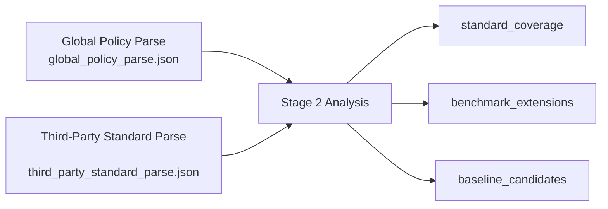
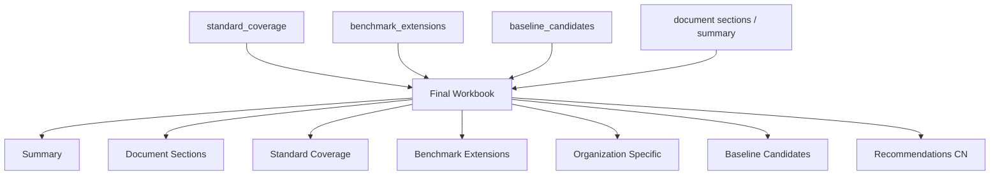

# Stage 2 Redesign

## 背景

当前项目的整体三阶段结构是合理的：

1. Stage 1 解析原始文档
2. Stage 2 做 requirement 对齐与 baseline 中间结果生成
3. Stage 3 输出最终交付 workbook

其中真正需要重新定义的重点在 Stage 2。

当前实现中，Stage 2 更接近一种 benchmark-centered 的分析模式：

- 以 benchmark requirement 为行
- 判断 Global Standard 是否覆盖它
- 输出 `aligned / partial / gap`

这种方式并不是错误的，但它和当前更准确的业务目标存在偏差。

## 新的业务定义

Stage 2 应重新定义为：

**以 Global Standard 为主线，检查 benchmark 对它的满足情况，并指出：**

- 哪些 Global Standard 要求在 benchmark 中没有被涉及
- 哪些 benchmark 描述了多于 Global Standard 要求的内容
- 这些额外内容中，哪些值得转译为可落地的 cloud baseline controls

换句话说：

- Global Standard 是 authority
- benchmark 是 reference / lens
- Stage 2 的重点不是“benchmark 有没有被 standard 覆盖”
- 而是“standard 在 benchmark 中体现得怎么样，以及 benchmark 额外告诉了我们什么”

## 当前实现存在的问题

### 1. 分析主轴偏 benchmark-centered

当前 `baseline_analysis.json` 的核心行级结构以 benchmark requirement 为主轴。

这带来两个结果：

- 输出更容易回答“benchmark 还缺多少”
- 但不容易回答“Global Standard 中哪些要求被 benchmark 涉及”

### 2. gap 容易被误读

当输出出现大量 `gap` 时，读者容易误以为：

- Global Standard 写得很差
- 系统过于严格

但实际上 `gap` 可能混合了几种不同情况：

- benchmark 额外给出的平台细控
- Global Standard 没有写到实施级别
- benchmark 和组织治理要求关注点不同

### 3. 组织独有要求没有被单独建模

当前虽然有 `Organizational Only` 结果，但其语义仍然偏“剩余项”，而不是一个明确的分析维度。

### 4. benchmark 超出 standard 的内容没有被单独建模

当前这些内容往往被塞进：

- `gap`
- `new_baseline_control`

但这还不够精确。

更好的表达应该是：

- benchmark 对 standard 的平台化补强
- benchmark 的实施级增强
- benchmark 引入的新增控制领域

## 新的 Stage 2 定义

Stage 2 应拆成两个分析视角，但主轴是 Global Standard。

### Stage 2A: Standard Coverage Analysis

针对每条 Global Standard requirement，判断：

- benchmark 是否涉及
- 是直接覆盖还是部分覆盖
- 如果没有涉及，是 benchmark 不关注，还是这是组织独有治理要求

### Stage 2B: Benchmark Extension Analysis

针对 benchmark requirement，判断：

- 它是否在描述超出 Global Standard 的内容
- 这种超出属于哪种类型
- 是否应该纳入 cloud baseline

因此，Stage 2 不再只是一个“gap 生成器”，而是一个：

- coverage analyzer
- extension analyzer
- baseline candidate generator

## 新的 Stage 2 输入输出关系

## 新的 artifact 设计

建议未来 Stage 2 的主 artifact 至少包含三类核心结构。

## 1. `standard_coverage`

以 Global Standard requirement 为主轴。

每条记录建议包含：

- `global_requirement_id`
- `global_source_requirement_id`
- `global_section`
- `global_statement`
- `category`
- `priority`
- `matched_benchmark_requirements`
- `coverage_status`
- `coverage_rationale`

### `coverage_status` 建议枚举

- `covered`
- `partially_covered`
- `not_addressed_by_benchmark`
- `organization_specific`

### 语义说明

- `covered`
  - benchmark 清楚体现了该 Global Standard requirement 的核心意图
- `partially_covered`
  - benchmark 涉及该要求，但表达范围或粒度不足
- `not_addressed_by_benchmark`
  - benchmark 没有体现该要求
- `organization_specific`
  - 该要求是组织独有治理要求，不应期待 benchmark 提供对应控制

## 2. `benchmark_extensions`

以 benchmark requirement 为主轴，但仅保留“超出 Global Standard”的内容。

每条记录建议包含：

- `benchmark_requirement_id`
- `benchmark_source_requirement_id`
- `benchmark_section`
- `benchmark_statement`
- `category`
- `service`
- `related_global_requirements`
- `extension_type`
- `extension_rationale`
- `baseline_candidate`
- `candidate_priority`

### `extension_type` 建议枚举

- `platform_specific_detail`
- `implementation_enrichment`
- `stronger_control`
- `new_control_area`

### 语义说明

- `platform_specific_detail`
  - Global Standard 有治理方向，但 benchmark 提供了平台化细节
- `implementation_enrichment`
  - benchmark 给出了更清晰的实施路径
- `stronger_control`
  - benchmark 对同一控制给出了更强约束
- `new_control_area`
  - benchmark 涉及了 Global Standard 尚未覆盖的领域

## 3. `baseline_candidates`

从 `benchmark_extensions` 中筛选出建议转译为 Alibaba Cloud baseline controls 的内容。

每条记录建议包含：

- `candidate_id`
- `source_benchmark_requirement_id`
- `source_benchmark_source_requirement_id`
- `proposed_control_title`
- `proposed_control_statement`
- `category`
- `service`
- `candidate_priority`
- `reason_for_inclusion`
- `related_global_requirements`

## 新的 Stage 2 核心问题

未来 Stage 2 应围绕以下三个问题设计 prompt、规则和输出结构：

### Q1. Global Standard 被 benchmark 覆盖了吗？

这决定：

- `standard_coverage`

### Q2. benchmark 讲了哪些 Global Standard 没明确讲到的内容？

这决定：

- `benchmark_extensions`

### Q3. benchmark 中额外的内容里，哪些值得纳入云平台基线？

这决定：

- `baseline_candidates`

## 对当前 `aligned / partial / gap` 的处理建议

当前三分法不一定要立刻废弃，但建议降低它作为主分析结构的地位。

未来可以考虑：

- 把它作为 `benchmark_extensions` 或兼容视图的一部分
- 不再把它作为整个 Stage 2 的唯一核心表达

建议对应关系：

- `aligned`
  - 可映射到 `covered`
- `partial`
  - 可映射到 `partially_covered`
- `gap`
  - 需要拆开：
    - `not_addressed_by_benchmark`
    - `new_control_area`
    - `platform_specific_detail`
    - `stronger_control`

也就是说：

当前 `gap` 粒度太粗，语义负担过重。

## 对最终 workbook 的影响

当前 workbook 主要包含：

- `Summary`
- `Document Sections`
- `Control Mapping`
- `Pending Controls`
- `Organizational Only`
- `Recommendations CN`

如果 Stage 2 按新模型重构，建议 future workbook 也做相应调整。

## 推荐保留的 sheet

- `Summary`
- `Document Sections`
- `Recommendations CN`

## 推荐替换/重构的 sheet

### 1. `Standard Coverage`

以 Global Standard requirement 为行。

推荐列：

- `Global Requirement ID`
- `Global Source Requirement ID`
- `Section`
- `Statement`
- `Category`
- `Priority`
- `Coverage Status`
- `Matched Benchmark Requirements`
- `Rationale`

### 2. `Benchmark Extensions`

列出 benchmark 中超出 Global Standard 的内容。

推荐列：

- `Benchmark Requirement ID`
- `Benchmark Source Requirement ID`
- `Section`
- `Statement`
- `Category`
- `Service`
- `Extension Type`
- `Related Global Requirements`
- `Baseline Candidate`
- `Candidate Priority`
- `Rationale`

### 3. `Organization Specific`

列出 Global Standard 中 benchmark 没体现，但应保留的组织要求。

推荐列：

- `Global Requirement ID`
- `Global Source Requirement ID`
- `Section`
- `Statement`
- `Category`
- `Priority`
- `Reason`

### 4. `Baseline Candidates`

列出建议纳入 Alibaba Cloud baseline 的候选控制。

推荐列：

- `Candidate ID`
- `Source Benchmark Requirement`
- `Proposed Control`
- `Category`
- `Service`
- `Priority`
- `Reason`

## 新的 workbook 结构图

## 对 `baseline_writer` 的影响

当前 `baseline_writer` 是 `skill02` 的子模块，用于生成：

- `baseline_controls.md`
- `baseline_report.md`
- `baseline_priority_recommendations_cn.md`

在新的 Stage 2 设计下，`baseline_writer` 不一定要立刻删除，但建议未来做两种可能演化：

### 方案 A

保留 `baseline_writer`，但输入由旧的 benchmark-centered `mapping_analysis.json` 改为新 artifact。

### 方案 B

将其职责收缩为：

- markdown summary renderer
- recommendation renderer

而不要继续承担旧式 mapping 兼容桥接逻辑。

## 迁移策略

建议按最小风险路径推进。

## 第一步：更新文档和语义

先完成：

- 项目描述调整
- Stage 2 新定义固化
- artifact schema 设计文档落盘
- workbook sheet 设计文档落盘

此阶段不改动大量代码。

## 第二步：在代码中保留兼容层，新增新 artifact

目标：

- 不马上删除旧的 `baseline_analysis.json` 兼容输出
- 同时新增新的 coverage / extension artifact

例如：

- `standard_coverage.json`
- `benchmark_extensions.json`
- `baseline_candidates.json`

这样可以让 Stage 3 平滑迁移。

## 第三步：调整 Stage 3

让 `skill03` 不再以旧的 benchmark-centered mapping 为核心输入，而改为：

- `standard_coverage`
- `benchmark_extensions`
- `baseline_candidates`

然后生成新的 workbook 结构。

## 第四步：移除旧 Stage 2 兼容桥

待新 workbook 稳定后，再考虑：

- 逐步弱化旧 `mapping_analysis.json`
- 逐步弱化旧 `Control Mapping` / `Pending Controls` 视图

## Harness Engineering 视角下的意义

这个 redesign 与 harness engineering 的思想高度一致。

它强化了以下几点：

### 1. 清晰的 stage contract

每一阶段的目标和产物更明确。

### 2. 结构化 handoff

上下游之间依赖 artifact，而不是依赖长上下文记忆。

### 3. 分析语义与打包语义分离

Stage 2 负责分析，Stage 3 负责交付。

### 4. 更适合加入 evaluator

未来可以更容易加入：

- coverage review
- extension review
- candidate review

## 一句话总结

Stage 2 不应再只被理解为“基于 benchmark 生成 baseline”。

更准确的定义应是：

**以 Global Standard 为主线，分析其在 benchmark 中的覆盖情况，识别 benchmark 的额外控制内容，并从中提炼可落地的 cloud baseline candidates。**
